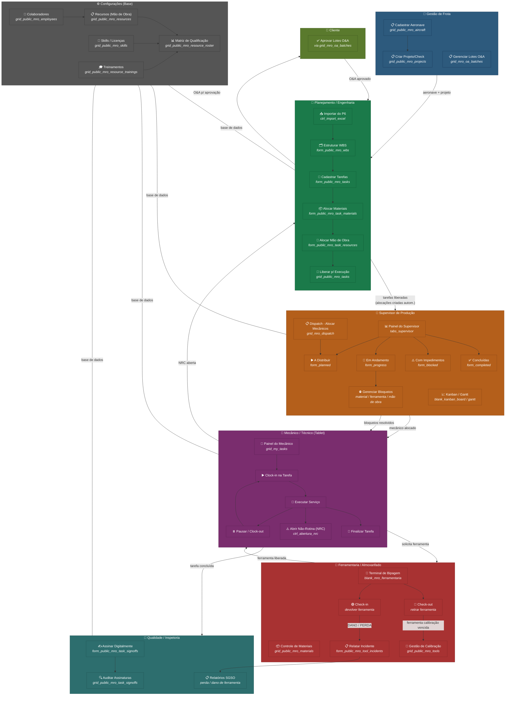

# Diagrama de Fluxo — Operadores do MRO System

## Papéis representados

| Papel | Cor | Responsabilidade principal |
|-------|-----|----------------------------|
| **Gestão de Frota** | Azul | Cadastro de aeronaves, projetos/checks, lotes O&A |
| **Planejamento / Engenharia** | Verde | Importação P6, WBS, tarefas, alocação de recursos, liberação |
| **Supervisor de Produção** | Laranja | Alocação de mecânicos, dispatch, Kanban, gerenciamento de bloqueios |
| **Mecânico / Técnico** | Roxo | Clock-in/out, execução no tablet, abertura de NRC |
| **Ferramentaria / Almoxarifado** | Vermelho | Terminal de bipagem, calibração, materiais, incidentes |
| **Qualidade / Inspetoria** | Teal | Assinatura digital, auditoria, relatórios SGSO |
| **Cliente** | Verde-oliva | Aprovação de lotes Over & Above |

## Fluxo principal

1. **Gestão de Frota** cadastra aeronaves e projetos
2. **Planejamento** importa do Primavera P6, estrutura WBS, cadastra tarefas e libera para execução
3. **Supervisor** distribui tarefas aos mecânicos pelo Dispatch
4. **Mecânico** executa no tablet com clock-in/out, abre NRCs e solicita ferramentas
5. **Ferramentaria** atende via terminal de bipagem com validação ANAC
6. **Qualidade** realiza assinatura digital das tarefas concluídas
7. **Cliente** aprova lotes O&A quando necessário

> ⚠️ **Nota:** O módulo **Security** (login, usuários, grupos, permissões, 2FA) não está representado neste diagrama pois o usuário já conhece seu funcionamento.
