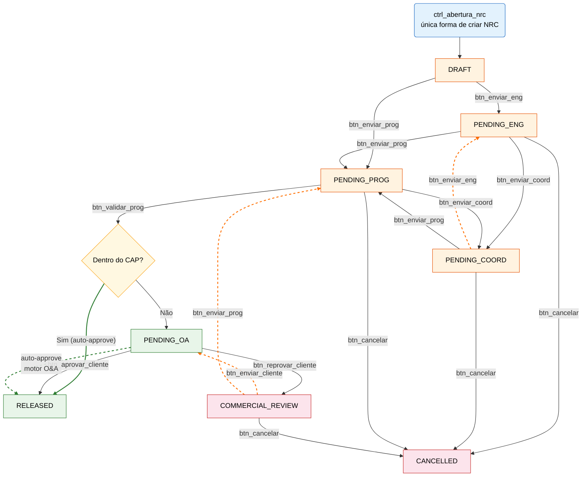

# Fluxo NRC — Workflow de Aprovação

> Diagrama de navegação do fluxo de aprovação de Não-Rotinas (NRC) no sistema MRO System.
> As setas **tracejadas laranja** representam retorno para fases anteriores.
> O nó **diamante amarelo** representa a decisão do **motor O&A (`mro_engine`)** acionado por `btn_validar_prog`.

