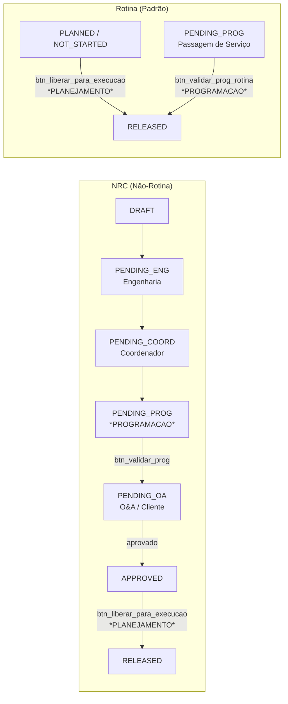

# Reunião com Key User — Teste dos Perfis Planejamento e Programação

> **Data:** 19/08/2026 — 15:00
> **Objetivo:** Validar junto ao key user o funcionamento dos perfis **PLANEJAMENTO** e **PROGRAMACAO** no MRO System (rotinas e não-rotinas).

---

## 1. Credenciais de teste

| Perfil | Group ID | Login | Senha |
|--------|:--------:|-------|-------|
| **PLANEJAMENTO** | 8 | `planejador` | `Planejador@321` |
| **PROGRAMACAO** | 7 | `programador` | `Programador@321` |

### Resumo dos perfis (baseado no código real do projeto):

PLANEJAMENTO — o dono do preparo: importa do P6, estrutura WBS, cadastra tarefas, aloca materiais/mão de obra, gerencia dependências, edita datas no Gantt e libera para execução (btn_liberar_para_execucao → RELEASED + gera assignments por skill).

PROGRAMACAO — o filtro interno de validação: valida NRC (btn_validar_prog → PENDING_OA/O&A), valida rotina em passagem de serviço (btn_validar_prog_rotina → RELEASED sem O&A, regra da MRO-120), envia de volta ao coordenador e cancela quando inviável.

> ⚠️ Durante o teste, o usuário deve ter **apenas o perfil sendo testado** (evitar contas com múltiplos grupos) para validar o comportamento real de cada perfil.

---

## 2. Resumo — O que cada perfil faz

### PLANEJAMENTO (group_id = 8)

O perfil é responsável por **estruturar e preparar o trabalho** antes da execução no hangar. Ele atua na parte de backoffice:

| Responsabilidade | Onde (App) | Detalhe |
|------------------|-----------|---------|
| **Importar pacotes do P6** | `ctrl_import_excel` | Importa pacotes de manutenção do Primavera P6 via CSV/Excel |
| **Estruturar EAP/WBS** | `grid_public_mro_wbs` / `form_public_mro_wbs` | Organiza a árvore de pacotes de trabalho do projeto |
| **Cadastrar Tarefas (Rotinas)** | `form_public_mro_tasks` | Cria/edita rotinas; **update liberado** em quase todos os status (exceto RELEASED, COMPLETED, CANCELLED) |
| **Criar NRCs diretamente** | `form_public_mro_tasks` | Na Fase 1 (DRAFT), se for o criador, vê `btn_enviar_eng`, `btn_enviar_prog`, `delete`, `update` — pode iniciar o fluxo de aprovação sem depender do mecânico |
| **Alocar Materiais** | `form_public_mro_task_materials` | Vincula materiais às tarefas |
| **Alocar Mão de Obra (recursos)** | `form_public_mro_task_resources` | Vincula recursos/labor importados do P6; exibe horas consumidas por skill |
| **Gerenciar Dependências** | `form_public_mro_task_dependencies_{predecessoras,sucessoras}` | Cadastra/edita vínculos de predecessoras e sucessoras (bloqueios) |
| **Editar Datas de Planejamento** | `blank_gantt` | Arrasta a barra no Gantt (Syncfusion) para ajustar `target_start`/`target_end`; duplo clique abre o form para edição completa; validação exige datas quando a fase está definida (rotinas) |
| **Liberar para Execução** | `grid_public_mro_tasks` → `btn_liberar_para_execucao` | Altera status `PLANNED`/`NOT_STARTED`/`APPROVED` → `RELEASED`, valida predecessores, grava audit log e **cria os assignments por skill** (ou fallback genérico quando o P6 não enviou recursos) |
| **Alternar Bloqueios** | `grid_public_mro_tasks` | Alterna flags `is_blocked_material`, `is_blocked_tool`, `is_blocked_labor` pelos ícones `btn_mat`, `btn_fer`, `btn_mao` |
| **Visualizar bloco financeiro** | `form_public_mro_tasks` | Como não é MECANICO, enxerga o `bloco_financeiro` (O&A) quando aplicável |

**Em resumo:** O PLANEJAMENTO é o **dono do preparo** — importa, estrutura, aloca recursos/materiais e **libera a tarefa** para a execução. É ele quem decide quando a tarefa fica pronta para ir ao hangar.

---

### PROGRAMACAO (group_id = 7)

O perfil é o **filtro interno de validação**, responsável por conferir se a tarefa/NRC está pronta para seguir no fluxo (validação no P6 / programação):

| Responsabilidade | Onde (App) | Detalhe |
|------------------|-----------|---------|
| **Validar NRC (Fase 4 — PENDING_PROG)** | `form_public_mro_tasks` → `btn_validar_prog` | Dispara a lógica de Over & Above (O&A); status vai para `PENDING_OA` (aguardando cliente) |
| **Enviar NRC de volta ao Coordenador** | `form_public_mro_tasks` → `btn_enviar_coord` | Quando a NRC precisa de reavaliação |
| **Cancelar NRC** | `form_public_mro_tasks` → `btn_cancelar` | Quando não é viável |
| **Validar Rotina em Passagem de Serviço (MRO-120)** | `form_public_mro_tasks` → `btn_validar_prog_rotina` | Rotinas vindas da passagem de serviço (`PENDING_PROG`, `is_nrc` vazio) são validadas pela Programação e vão direto para `RELEASED` **sem O&A** |
| **Gerenciar Dependências** | `form_public_mro_task_dependencies_{predecessoras,sucessoras}` | Mesmo acesso do PLANEJAMENTO (insert/update/delete) |
| **Impressão Pack JIC** | `blank_pdf_pack_jic` | Acesso liberado (export/print) |
| **Campo instruction_text** | `form_public_mro_tasks` | Read-only — não altera o relato original |

**Em resumo:** A PROGRAMACAO é o **último filtro interno** — valida a NRC no P6 e dispara o O&A para aprovação do cliente (NRC) ou valida a rotina de passagem de serviço liberando direto para execução (sem O&A).

---

## 3. Fluxo resumido dos status

---

## 4. Roteiro de Testes

> **Pré-requisito:** ter ao menos um projeto de teste com rotinas importadas/cadastradas e uma NRC em `PENDING_PROG`.

### 4.1 — Teste do Perfil PLANEJAMENTO

**Login:** `planejador` / `Planejador@321`

| # | Passo | Ação | Resultado Esperado |
|---|-------|------|--------------------|
| 1 | Login | Acessar o sistema com o perfil PLANEJAMENTO | Acessa normalmente; enxerga o módulo de Planejamento e Engenharia |
| 2 | Criar Rotina | `form_public_mro_tasks` → botão New (criar rotina) | Consegue criar uma rotina; status inicial `DRAFT` ou `PLANNED` |
| 3 | Editar Rotina | Abrir a rotina criada e alterar um campo (ex: `task_name`) | `update` liberado; salvamento OK |
| 4 | Alocar Recurso | `form_public_mro_task_resources` → adicionar recurso (LABOR) com horas planejadas | Recurso vinculado à tarefa; tela mostra horas consumidas por skill |
| 5 | Alocar Material | `form_public_mro_task_materials` → adicionar material | Material vinculado à tarefa |
| 6 | Dependências | `form_public_mro_task_dependencies_predecessoras` → vincular uma tarefa predecessora | Vínculo salvo; flag `is_blocked_predecessor` fica ativa na grid |
| 7 | Datas no Gantt | Abrir `blank_gantt` do projeto → arrastar a barra da rotina | Salva `target_start`/`target_end`; duplo clique abre o form de edição |
| 8 | **Liberar para Execução** | `grid_public_mro_tasks` → selecionar rotina com status `PLANNED`/`NOT_STARTED` → botão `btn_liberar_para_execucao` | Status vira `RELEASED`; audit log gravado; **assignments criados por skill** (ou fallback genérico); tarefa aparece para o Supervisor/Mecânico |
| 9 | Alternar Bloqueio | Na grid, clicar no ícone `btn_mat`/`btn_fer`/`btn_mao` de uma tarefa | Flag de bloqueio alterna; ícone muda de cor (vermelho/roxo/laranja) |
| 10 | Criar NRC | Criar uma NRC (DRAFT) como planejador | Enxerga `btn_enviar_eng` e `btn_enviar_prog` (pode disparar o fluxo sem depender do mecânico) |
| 11 | NRC aprovada | Com uma NRC em `APPROVED` (aprovada pelo cliente), liberar para execução | Vira `RELEASED` e gera assignments (regra MRO-122) |

**Pontos de atenção (perguntar ao key user):**
- O fluxo de liberação está claro? As datas (target_start/end) fazem sentido?
- Os assignments gerados por skill estão corretos após a liberação?

---

### 4.2 — Teste do Perfil PROGRAMACAO

**Login:** `programador` / `Programador@321`

| # | Passo | Ação | Resultado Esperado |
|---|-------|------|--------------------|
| 1 | Login | Acessar o sistema com o perfil PROGRAMACAO | Acessa normalmente; não enxerga telas sem permissão (ex: dependências do MECANICO não aplicáveis) |
| 2 | Abrir NRC em PENDING_PROG | `form_public_mro_tasks` → abrir NRC com status `PENDING_PROG` | Campo `instruction_text` read-only; vê os botões `btn_validar_prog`, `btn_enviar_coord`, `btn_cancelar`, `update` |
| 3 | **Validar NRC** | Clicar em `btn_validar_prog` | Dispara lógica de O&A; status muda para `PENDING_OA` (aguardando cliente) |
| 4 | Validar outra NRC com retorno | Abrir outra NRC em `PENDING_PROG` → `btn_enviar_coord` | NRC volta para o Coordenador (`PENDING_COORD`) |
| 5 | **Validar Rotina (Passagem de Serviço)** | Abrir uma **rotina** (não NRC) com status `PENDING_PROG` (vinda da passagem de serviço) → `btn_validar_prog_rotina` | Status vai direto para `RELEASED` **sem O&A**; não gera pendência de mão de obra |
| 6 | Dependentes | Verificar acesso a `form_public_mro_task_dependencies_*` | Insert/update/delete liberados (igual ao form mestre) |
| 7 | Pack JIC | Abrir `blank_pdf_pack_jic` em uma tarefa | Consegue gerar/exportar o pack (JIC, JEC, JMC, Shift Turnover, Calibrated Tool) |
| 8 | Bloco financeiro | Abrir NRC em `PENDING_OA` | Como não é MECANICO, enxerga o `bloco_financeiro` (valores O&A) |

**Pontos de atenção (perguntar ao key user):**
- A regra da passagem de serviço (MRO-120) está correta — rotina validada vai direto para `RELEASED` sem O&A?
- A Programação deve enxergar o bloco financeiro das NRCs? (hoje enxerga por não ser MECANICO)
- Quando há múltiplos mecânicos na tarefa, a passagem de serviço só é obrigatória para o **último** mecânico (regra MRO-120) — validar esse cenário com o supervisor.

---

## 5. Checklist rápido da reunião

- [ ] Validar acessos/apps visíveis para PLANEJAMENTO e PROGRAMACAO (nada a mais, nada a menos)
- [ ] Testar liberação de rotina pelo PLANEJAMENTO (assignments por skill)
- [ ] Testar liberação de NRC aprovada pelo cliente (MRO-122)
- [ ] Testar validação de NRC pela PROGRAMACAO (→ PENDING_OA / O&A)
- [ ] Testar validação de rotina em passagem de serviço (→ RELEASED sem O&A)
- [ ] Alinhar dúvidas: Gantt (datas), dependências, pack JIC, bloco financeiro
- [ ] Registrar pontos de melhoria / abertos para novas tarefas
