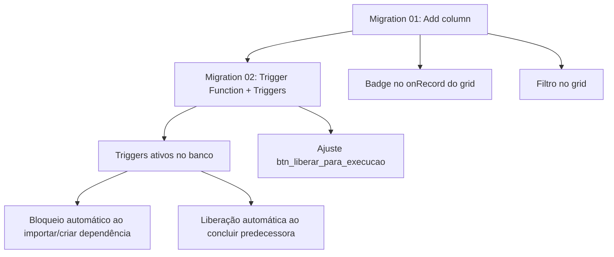

# PLANO — Bloqueio por Tarefa Predecessora

> **Demanda:** Rodrigo Souza — 28/07/2026
> **Tarefa:** MRO-119 (incorporado)
> **Objetivo:** Implementar mecanismo de bloqueio/liberação automática de tarefas sucessoras com base no status de suas predecessoras, incluindo filtro visual no grid.

---

## 1. Situação Atual

### 1.1 O que já existe

| Item | Status |
|------|--------|
| Tabela `mro_task_dependencies` (PK, FK, 1.201 registros) | ✅ Existe |
| FK `predecessor_task_id` → `mro_tasks.task_id` | ✅ Existe |
| FK `successor_task_id` → `mro_tasks.task_id` | ✅ Existe |
| Tipo padrão `FS` (Finish-to-Start) | ✅ Existe |
| Importação via P6 (TASKPRED.csv) | ✅ Existe |
| Campo `dep_type` (varchar) | ✅ Existe |
| Campo `lag_hours` (numeric, default 0) | ✅ Existe |

### 1.2 O que NÃO existe (necessário implementar)

| Item | Status |
|------|--------|
| Campo `is_blocked_predecessor` (boolean) na `mro_tasks` | ❌ Não existe |
| Atualização automática ao criar dependência | ❌ Não existe |
| Atualização automática ao concluir predecessora | ❌ Não existe |
| Filtro no grid "Bloqueado por Predecessora" | ❌ Não existe |
| Interface visual para gerenciar dependências | ❌ Não existe |
| Validação no "Liberar para Execução" | ❌ Não existe |

---

## 2. Abordagem Proposta

### 2.1 Arquitetura: Campo Calculado vs Gatilho no Banco

**Opção escolhida: Gatilho no banco (trigger function) + campo booleano**

Isolando a lógica em trigger:
- Independe de linguagem (PHP/JS)
- Funciona para qualquer fluxo (importação, form, API futura)
- Garante consistência — não depende de evento ScriptCase ser chamado

### 2.2 Fluxo Lógico Completo

```
[A] CRIAÇÃO/IMPORTAÇÃO de dependência (predecessora + sucessora)
    ↓
    Trigger verifica: predecessora está COMPLETED ou CANCELLED?
    ├─ Sim → is_blocked_predecessor = false (sucessora livre)
    └─ Não → is_blocked_predecessor = true (sucessora bloqueada)

[B] CONCLUSÃO de uma tarefa (status → COMPLETED)
    ↓
    Trigger busca TODAS as sucessoras desta tarefa
    ↓
    Para cada sucessora:
      Verifica se AINDA existe alguma predecessora não concluída
      ├─ Sim → mantém is_blocked_predecessor = true
      └─ Não → is_blocked_predecessor = false (libera)

[C] LIBERAR PARA EXECUÇÃO (btn_liberar_para_execucao)
    ↓
    Antes de liberar, verificar:
    ├─ is_blocked_predecessor = true → BLOQUEAR: mensagem "Tarefa bloqueada por predecessora"
    └─ is_blocked_predecessor = false → PERMITIR liberação normalmente
```

### 2.3 Componentes da Implementação

| # | Componente | Tipo | Descrição |
|---|-----------|------|-----------|
| 1 | Migration SQL | DDL | Adicionar coluna `is_blocked_predecessor` |
| 2 | Trigger Function | PL/pgSQL | Função que calcula e atualiza o flag |
| 3 | Trigger | DML | Gatilho AFTER INSERT/UPDATE na `mro_task_dependencies` e na `mro_tasks.status_code` |
| 4 | OnRecord do grid | ScriptCase PHP | Badge visual (ícone vermelho) para tasks bloqueadas por predecessora |
| 5 | Filtro no grid | Config ScriptCase | Adicionar `is_blocked_predecessor` ao filtro refinado/avançado |
| 6 | btn_liberar_para_execucao | ScriptCase PHP | Validação de bloqueio antes de liberar |
| 7 | (Opcional) Form de dependências | Nova app | Interface visual para vincular predecessoras manualmente |

---

## 3. Detalhamento Técnico

### 3.1 Migration 01 — Adicionar coluna

```sql
-- MRO-119: Campo de bloqueio por predecessora
ALTER TABLE public.mro_tasks
ADD COLUMN is_blocked_predecessor boolean NOT NULL DEFAULT false;
```

### 3.2 Migração 02 — Trigger Function

```sql
CREATE OR REPLACE FUNCTION public.fn_update_blocked_predecessor()
RETURNS trigger
LANGUAGE plpgsql
AS $$
DECLARE
    v_task_id integer;
BEGIN
    -- Se for INSERT/UPDATE na mro_task_dependencies, processa a sucessora
    IF TG_TABLE_NAME = 'mro_task_dependencies' THEN
        IF TG_OP = 'INSERT' OR TG_OP = 'UPDATE' THEN
            v_task_id := NEW.successor_task_id;
        END IF;
    END IF;

    -- Se for UPDATE na mro_tasks (status_code), processa todas as sucessoras
    IF TG_TABLE_NAME = 'mro_tasks' THEN
        IF TG_OP = 'UPDATE' AND (OLD.status_code IS DISTINCT FROM NEW.status_code) THEN
            -- Atualiza flag das sucessoras diretas
            UPDATE mro_tasks t
            SET is_blocked_predecessor = EXISTS (
                SELECT 1
                FROM mro_task_dependencies d
                JOIN mro_tasks pred ON pred.task_id = d.predecessor_task_id
                WHERE d.successor_task_id = t.task_id
                  AND pred.status_code NOT IN ('COMPLETED', 'CANCELLED')
            )
            WHERE t.task_id IN (
                SELECT successor_task_id
                FROM mro_task_dependencies
                WHERE predecessor_task_id = NEW.task_id
            );

            -- Atualiza flag da própria task (se for sucessora de alguém)
            UPDATE mro_tasks t
            SET is_blocked_predecessor = EXISTS (
                SELECT 1
                FROM mro_task_dependencies d
                JOIN mro_tasks pred ON pred.task_id = d.predecessor_task_id
                WHERE d.successor_task_id = t.task_id
                  AND pred.status_code NOT IN ('COMPLETED', 'CANCELLED')
            )
            WHERE t.task_id = NEW.task_id;

            RETURN NEW;
        END IF;
    END IF;

    RETURN NEW;
END;
$$;
```

### 3.3 Triggers

```sql
-- Trigger na mro_task_dependencies (após INSERT ou UPDATE)
CREATE TRIGGER trg_task_dependencies_blocked
AFTER INSERT OR UPDATE ON public.mro_task_dependencies
FOR EACH ROW
EXECUTE FUNCTION public.fn_update_blocked_predecessor();

-- Trigger na mro_tasks (após UPDATE de status_code)
CREATE TRIGGER trg_tasks_status_blocked
AFTER UPDATE OF status_code ON public.mro_tasks
FOR EACH ROW
EXECUTE FUNCTION public.fn_update_blocked_predecessor();
```

### 3.4 Script PHP — onRecord do grid_public_mro_tasks

Adicionar badge visual no `events/04_onRecord/onRecord.scriptcase`:

```php
// MRO-119: Badge de bloqueio por predecessora
if (!empty({is_blocked_predecessor}) && {is_blocked_predecessor} == 't') {
    {predecessor_badge} = "<span style='background: #fce4ec; color: #c62828; padding: 2px 8px; border-radius: 4px; font-size: 11px; white-space: nowrap;' title='Bloqueada por tarefa predecessora'>
        <i class='fas fa-link-slash'></i> Bloqueada Pred.
    </span>";
} else {
    {predecessor_badge} = "";
}
```

E adicionar campo `predecessor_badge` (varchar) no `config.json` do grid.

### 3.5 Ajuste no btn_liberar_para_execucao

**Arquivo:** `tasks/grid_public_mro_tasks/button/btn_liberar_para_execucao.scriptcase`

Adicionar no início, antes de qualquer lógica:

```php
// MRO-119: Verificar bloqueio por predecessora
$v_task_id = {task_id};
$v_is_blocked_pred = {is_blocked_predecessor};

if ($v_is_blocked_pred == 't' || $v_is_blocked_pred === true || $v_is_blocked_pred == 1) {
    sc_error_message("Esta tarefa não pode ser liberada porque possui dependência de uma tarefa predecessora que ainda não foi concluída.");
    sc_error_exit();
}
```

### 3.6 Filtro no grid

Adicionar `is_blocked_predecessor` ao filtro refinado/avançado do `grid_public_mro_tasks` (configuração no ScriptCase IDE).

### 3.7 (Opcional) Interface visual — form_public_mro_task_dependencies

Criar app simples tipo Form/Grid para gerenciar dependências visualmente:

```
tasks/form_public_mro_task_dependencies/
├── config.json
├── sql/schema.sql
└── events/
    └── ...
```

Mas podemos deixar para um segundo momento, pois a principio a importação P6 já alimenta as dependências e o bloqueio será automático via trigger.

---

## 4. Dependências entre os Componentes



---

## 5. Ordem de Execução

| # | Ação | Responsável | Arquivo/App |
|---|------|-------------|-------------|
| 1 | Executar Migration 01 (add column) | DBA | `migrations/MRO-119_03_add_is_blocked_predecessor.sql` |
| 2 | Executar Migration 02 (trigger function + triggers) | DBA | `migrations/MRO-119_04_trigger_blocked_predecessor.sql` |
| 3 | Executar UPDATE inicial para sincronizar registros existentes | DBA | SQL avulso |
| 4 | Adicionar badge `predecessor_badge` no onRecord do grid | Dev | `grid_public_mro_tasks/events/04_onRecord/` |
| 5 | Adicionar campo `predecessor_badge` no config.json do grid | Dev | `grid_public_mro_tasks/config.json` |
| 6 | Adicionar `is_blocked_predecessor` ao filtro refinado/avançado | Dev | ScriptCase IDE |
| 7 | Ajustar `btn_liberar_para_execucao` com validação | Dev | `grid_public_mro_tasks/button/` |
| 8 | Testar fluxo completo: criar dep → bloquear → concluir → liberar | QA | Homologação |

---

## 6. Testes

### 6.1 Cenário A — Bloqueio ao criar dependência

1. Task X (predecessora) com status `IN_PROGRESS`
2. Task Y (sucessora) sem bloqueio
3. Inserir registro em `mro_task_dependencies` (X → Y)
4. **Esperado:** `is_blocked_predecessor` da Task Y = `true`

### 6.2 Cenário B — Liberação ao concluir predecessora

1. Task X (predecessora) com status `IN_PROGRESS`
2. Task Y (sucessora) com `is_blocked_predecessor = true`
3. Atualizar Task X para `COMPLETED`
4. **Esperado:** `is_blocked_predecessor` da Task Y = `false`

### 6.3 Cenário C — Múltiplas predecessoras

1. Task X e Task W (predecessoras), Task Y (sucessora de ambas)
2. Concluir apenas Task X
3. **Esperado:** `is_blocked_predecessor` da Task Y ainda = `true` (W ainda não concluída)
4. Concluir Task W
5. **Esperado:** `is_blocked_predecessor` da Task Y = `false`

### 6.4 Cenário D — Validação no Liberar para Execução

1. Task Y com `is_blocked_predecessor = true`
2. Clicar "Liberar para Execução"
3. **Esperado:** Bloqueado com mensagem de erro

### 6.5 Cenário E — Liberação normal (sem bloqueio)

1. Task Z sem dependências
2. Clicar "Liberar para Execução"
3. **Esperado:** Liberado normalmente

---

## 7. Riscos e Pontos de Atenção

| Risco | Descrição | Mitigação |
|-------|-----------|-----------|
| **Performance** | Trigger pode ser lenta em UPDATE batch de muitas tasks | Índice em `mro_task_dependencies(successor_task_id)` e `(predecessor_task_id)`. Testar com volume real |
| **Trigger recursiva** | Atualizar `is_blocked_predecessor` pode causar loop se houver trigger na mesma coluna | A trigger só atualiza a coluna, não dispara novamente. Garantir que a trigger escuta `status_code`, não a coluna `is_blocked_predecessor` |
| **Importação existente** | Registros antigos não terão o flag calculado | Migration de sincronização inicial (UPDATE em lote) |
| **Interface visual** | Usuário não tem como ver/gerenciar dependências | Fica para próxima iteração — criar `form_public_mro_task_dependencies` |

---

## 8. Arquivos a Criar/Editar

### Criados

| Arquivo | Conteúdo |
|---------|----------|
| `__Tarefas/MRO-119/PLANO-IMPEDIMENTO-PREDECESSORA.md` | Este documento |
| `__Tarefas/MRO-119/migrations/MRO-119_03_add_is_blocked_predecessor.sql` | DDL: add column |
| `__Tarefas/MRO-119/migrations/MRO-119_04_trigger_blocked_predecessor.sql` | DDL: trigger function + triggers |

### Editados

| Arquivo | Alteração |
|---------|-----------|
| `tasks/grid_public_mro_tasks/config.json` | + campo `predecessor_badge` (varchar) |
| `tasks/grid_public_mro_tasks/events/04_onRecord/onRecord.scriptcase` | + badge visual |
| `tasks/grid_public_mro_tasks/button/btn_liberar_para_execucao.scriptcase` | + validação de bloqueio |
| `tasks/grid_public_mro_tasks/` | Config ScriptCase: add `is_blocked_predecessor` ao filtro |
